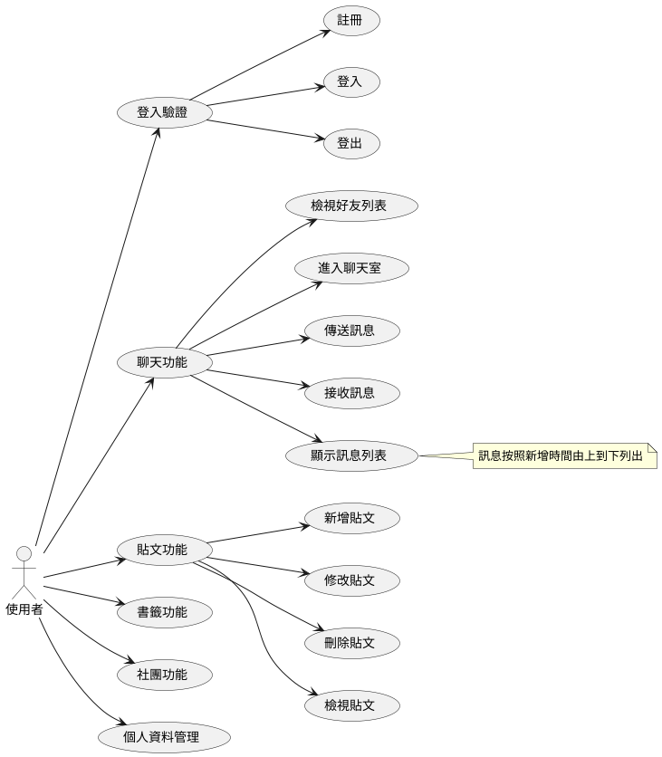

# 課程:軟體工程與演算法 -- 習題專案

欄位 | 內容
-----|--------
學期 | 109 學年度上學期
學生 |  黃朝新
學號末兩碼 | 05
教師 | [陳鍾誠](https://www.nqu.edu.tw/educsie/index.php?act=blog&code=list&ids=4)
學校科系 | [金門大學資訊工程系](https://www.nqu.edu.tw/educsie/index.php)
課程內容 | https://gitlab.com/ccc109/se

